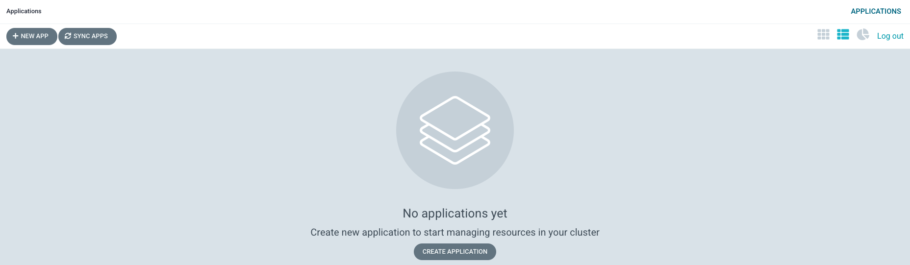

# Configure the Cluster for GitOps

**Audience:** Architects, Application Developers, Administrators

## Overview

In this topic, you will:

- Create a GitHub organization for GitOps repositories
- Clone and review sample GitOps repositories
- Install and configure ArgoCD for continuous deployment
- Set up custom ArgoCD instance with IBM Cloud Pak health checks
- Access and configure the ArgoCD web console

By the end of this topic, you'll have all the basic components in place to perform GitOps in your cluster.

## Introduction

Continuous integration and continuous deployment (CI/CD) are at the core of a typical ACE deployment. They ensure that any changes to source applications and configurations are automatically built and tested before they are deployed, helping to ensure their correctness and the integrity of the cluster.

ACE applications are defined, configured, and changed using a **GitOps model**. GitOps puts git repositories and git commands such as `git push` (to request a change) and `git merge` (to approve a change) at the heart of configuration management. A GitOps approach helps an organization implement best practices in version control and release governance based on a widely used open standard — **git**.

### GitOps Architecture Overview

The following diagram outlines the major components in a GitOps ACE CI/CD process:


Notice the clear separation of concerns:

- **Tekton pipelines** (OpenShift Pipelines) use Integration Application (message flows, ESQL, mapping, etc.) and configurations (serverconf, policy projects) source repositories to build and store successfully tested Kubernetes artifacts in a Git config repository or image registry. While Kubernetes resources (e.g., pods, routes...) can be created as part of the pipeline run to test the source change, these resources only last for the duration of the pipeline run. It is the resultant Git and container image registry resources that are used to affect changes to the cluster in a subsequent, asynchronous processing step controlled by ArgoCD.

- **ArgoCD applications** (OpenShift GitOps) watch a Git config repository for changes built as a result of successful pipeline runs. This repository identifies the latest version of the application using information stored in Git and an image repository. OpenShift GitOps applies the Kubernetes resources thus identified to the cluster, resulting in new or updated Kubernetes resources that represent the changed ACE workflow applications and Integration Servers and its ecosystem, such as pods, routes, etc. In contrast to pipeline runs, OpenShift GitOps changes are durable; they remain as defined unless and until they are explicitly changed or deleted in the GitOps repository. Moreover, if the cluster resources drift from their Git config values, ArgoCD will restore them to their desired values; only changes that are applied to the Git config repository affect the long-term state of the cluster.

OpenShift Pipelines and OpenShift GitOps are used to separate **Continuous Integration** from **Continuous Deployment**. Often, the Tekton pipeline will perform its changes under a pull-request (PR) to provide an explicit approval mechanism for cluster changes. This is especially important in higher environments such as production which require a formal sign-off. Lower environments such as development often apply successful pipeline runs directly to the Git config repository that are immediately seen by ArgoCD and applied to the cluster.

## Prerequisites

Before attempting this section, you must have completed the following tasks:

- ✅ Created an OCP cluster instance
- ✅ Installed the `oc` command that matches your cluster version (4.19+ client, 4.16+ server)
- ✅ Installed `npm`, `git`, `tree`, and `jq` commands
- ✅ Have cluster administrator access

!!! tip "Quick Setup"
    Use our [prerequisites script](https://raw.githubusercontent.com/ibmexpertlabs/ACE_Production_Guide/main/prerequisites.sh) to automatically install most required tools:
    ```bash
    curl -O https://raw.githubusercontent.com/ibmexpertlabs/ACE_Production_Guide/main/prerequisites.sh
    chmod +x prerequisites.sh
    ./prerequisites.sh
    ```

!!! tip "OpenShift CLI Installation"
    Use these [instructions](https://docs.openshift.com/container-platform/4.16/cli_reference/openshift_cli/getting-started-cli.html) to get the latest version of `oc`. Use `oc version` to confirm that you have:
    - **Client Version:** 4.19 or higher
    - **Server Version:** 4.16 or higher

## Fork and Clone GitOps Repositories

Since this guide is designed for community contribution, you should fork the GitOps repositories to your own GitHub account and then clone them to your local environment.

### 1. Fork the GitOps Repositories

1. Navigate to the [multi-tenancy-gitops repository](https://github.com/ibmclientengineering/multi-tenancy-gitops)
2. Click the **"Fork"** button to create your own copy
3. Repeat for the supporting repositories:
   - [multi-tenancy-gitops-infra](https://github.com/ibmclientengineering/multi-tenancy-gitops-infra)
   - [multi-tenancy-gitops-services](https://github.com/ibmclientengineering/multi-tenancy-gitops-services)
   - [multi-tenancy-gitops-apps](https://github.com/ibmclientengineering/multi-tenancy-gitops-apps)

### 2. Clone Your Forked Repositories

```bash
# Clone your forked main GitOps repository
git clone https://github.com/YOUR-USERNAME/multi-tenancy-gitops.git
cd multi-tenancy-gitops

# Clone the supporting repositories
git clone https://github.com/YOUR-USERNAME/multi-tenancy-gitops-infra.git
git clone https://github.com/YOUR-USERNAME/multi-tenancy-gitops-services.git
git clone https://github.com/YOUR-USERNAME/multi-tenancy-gitops-apps.git
```

!!! important "Repository Customization"
    Replace `YOUR-USERNAME` with your actual GitHub username. You'll need to update the `repoURL` in the bootstrap.yaml file to point to your forked repository.

### 3. Review Repository Structure

Take a moment to explore the repository structure:

```bash
# View the main repository structure
tree multi-tenancy-gitops -L 2

# Review the ArgoCD applications
ls multi-tenancy-gitops/0-bootstrap/single-cluster/1-infrastructure/
```

## Installing ArgoCD

ArgoCD is the GitOps continuous delivery tool that will manage our cluster state based on Git repository contents.

### 1. Install ArgoCD Operator

ArgoCD is installed via the OpenShift GitOps operator. The installation process creates:

- ArgoCD operator subscription
- Default ArgoCD instance
- Required cluster roles and bindings

```bash
# Apply the ArgoCD installation manifests
oc apply -f setup/ocp4x/ -n openshift-operators
```

You should see output similar to:
```
Warning: resource clusterroles/custom-argocd-cluster-argocd-application-controller is missing the kubectl.kubernetes.io/last-applied-configuration annotation which is required by oc apply. oc apply should only be used on resources created declaratively by either oc create --save-config or oc apply. The missing annotation will be patched automatically.
clusterrole.rbac.authorization.k8s.io/custom-argocd-cluster-argocd-application-controller configured
Warning: resource clusterrolebindings/openshift-gitops-argocd-application-controller is missing the kubectl.kubernetes.io/last-applied-configuration annotation which is required by oc apply. oc apply should only be used on resources created declaratively by either oc create --save-config or oc apply. The missing annotation will be patched automatically.
clusterrolebinding.rbac.authorization.k8s.io/openshift-gitops-argocd-application-controller configured
clusterrolebinding.rbac.authorization.k8s.io/openshift-gitops-cntk-argocd-application-controller created
subscription.operators.coreos.com/openshift-gitops-operator created
```

!!! note "Open Source Community Approach"
    This guide is designed for community contribution. Users should fork this repository, customize it for their environment, and contribute improvements back to the community. The GitOps repositories are structured to be easily forked and customized.

### 2. Verify Installation

The ArgoCD operator installation takes some time, and once the operator has been installed, the default instance of ArgoCD also takes a little time to create. We can now issue two commands which, in turn, will wait for the ArgoCD operator to be installed and for the default instance of ArgoCD to be started.

```bash
# Wait for the ArgoCD operator to be installed
while ! oc wait crd applications.argoproj.io --timeout=-1s --for=condition=Established 2>/dev/null; do 
    echo "Waiting for ArgoCD operator..."
    sleep 30
done

# Wait for ArgoCD pods to be ready
while ! oc wait pod --timeout=-1s --for=condition=Ready --all -n openshift-gitops 2>/dev/null; do 
    echo "Waiting for ArgoCD pods..."
    sleep 30
done
```

After a while, you should see the following message informing us that operator installation is complete (it may take a few minutes):
```
customresourcedefinition.apiextensions.k8s.io/applications.argoproj.io condition met
```

The ArgoCD operator is now installed and the default instance has been successfully created.

### 3. Verify Cluster Roles

ArgoCD runs under a dedicated service account. For good governance, we use a custom **clusterrole** and **clusterrolebinding** to control the specific operations this service account can perform on different resources in the cluster.

```bash
# Verify cluster roles are created
oc get clusterrole custom-argocd-cluster-argocd-application-controller
oc get clusterrolebinding openshift-gitops-argocd-application-controller
oc get clusterrolebinding openshift-gitops-cntk-argocd-application-controller
```

You'll see the resources are created in the cluster:
```
$ oc get clusterrole custom-argocd-cluster-argocd-application-controller
NAME                                                  CREATED AT
custom-argocd-cluster-argocd-application-controller   2021-08-27T13:35:13Z
$ oc get clusterrolebinding openshift-gitops-argocd-application-controller
NAME                                             ROLE                                                              AGE
openshift-gitops-argocd-application-controller   ClusterRole/custom-argocd-cluster-argocd-application-controller   8m43s
$ oc get clusterrolebinding openshift-gitops-cntk-argocd-application-controller
NAME                                                  ROLE                                                              AGE
openshift-gitops-cntk-argocd-application-controller   ClusterRole/custom-argocd-cluster-argocd-application-controller   8m45s
```

The clusterrole `custom-argocd-cluster-argocd-application-controller` defines a specific set of resources that are required by the ArgoCD service account and access rights over them.

The cluster role bindings `openshift-gitops-argocd-application-controller` and `openshift-gitops-cntk-argocd-application-controller` bind the ArgoCD service account to the cluster role above.

In combination, these definitions limit ArgoCD to perform the minimum set of operations required to manage the cluster. This is important; it means that ArgoCD behaves as a well governed administrator of the cluster.

### 4. Remove Default Instance

As we'll see in a moment, the default instance of ArgoCD, created when we install the operator, isn't sufficient for our tutorial; we have to create a new one. But before we do this, we have to delete the default instance of ArgoCD.

```bash
# Delete the default ArgoCD instance
oc delete gitopsservice cluster || true
```

You will see the resources being deleted as follows:
```
gitopsservice.pipelines.openshift.io "cluster" deleted
```

Now that we've deleted the default instance, we can create a customized ArgoCD instance with additional capabilities.

## Creating a Custom ArgoCD Instance

The default instance of ArgoCD provides built-in health checks for standard Kubernetes resources. However, these checks are not sufficient for the **custom resources** added by IBM Cloud Paks. We need to create a custom instance with IBM Cloud Pak-specific health checks.

### 1. Review Custom Health Checks

The default instance of ArgoCD provides some built-in health checks for validating standard Kubernetes resources. However, these checks are not sufficient to check the health of the **custom resources** added by the IBM Cloud Paks; we need to create a custom instance of ArgoCD that implements some IBM Cloud Pak specific health checks.

You can explore these custom health checks in the ArgoCD YAML that we'll use to create the new ArgoCD instance:

```bash
cat setup/ocp4x/argocd-instance/argocd-instance.yaml
```

Notice, for example, a custom health check for queue managers:

```yaml
mq.ibm.com/QueueManager:
  health.lua: |
    hs = {}
    if obj.status ~= nil then
      if obj.status.phase ~= nil then
        hs.message = obj.status.phase
        if obj.status.phase == "Running" then
          hs.status = "Healthy"
        else
          hs.status = "Progressing"
        end
        return hs
      end
    end
    hs.status = "Progressing"
    hs.message = "Unknown"
    return hs
```

This logic is used by ArgoCD to determine when a queue manager is healthy.

You can learn more about the ArgoCD Resource Health [here](https://argoproj.github.io/argo-cd/operator-manual/health/) and ArgoCD custom **Lua** health checks [here](https://www.lua.org/).

### 2. Create Custom ArgoCD Instance

Now let's create the custom ArgoCD instance using this YAML.

Issue the following command to create a custom ArgoCD instance:

```bash
# Create the custom ArgoCD instance
oc apply -f setup/ocp4x/argocd-instance/ -n openshift-gitops
```

The response confirms that the below resources has been created:
```
argocd.argoproj.io/openshift-gitops-cntk created
```

Issue the below command; it will wait to complete until ArgoCD instance pod is up and running:

```bash
# Wait for ArgoCD instance to be ready
while ! oc wait pod --timeout=-1s --for=condition=ContainersReady -l app.kubernetes.io/name=openshift-gitops-cntk-server -n openshift-gitops > /dev/null; do 
    echo "Waiting for ArgoCD instance..."
    sleep 30
done
```

### 3. Associate a Certificate with the ArgoCD Instance

!!! warning "Firefox Browser Users"
    If you are using the Firefox browser, you will not be able to access the ArgoCD console until a valid certificate has been associated with it. Other browsers are unaffected; you can omit this step if you wish.

Some browsers will not allow you to access the ArgoCD instance unless it has been configured with a valid certificate. The following commands will associate a valid certificate directly with the ArgoCD instance.

```bash
# Create temporary directory
mkdir /tmp/argocd-cert
cd /tmp/argocd-cert

# Extract the ingress certificate
ingress_secret_name=$(oc get ingresscontroller.operator default \
  --namespace openshift-ingress-operator \
  -o jsonpath='{.spec.defaultCertificate.name}')

oc extract secret/$ingress_secret_name -n openshift-ingress

# Create TLS secret for ArgoCD
oc create secret tls -n openshift-gitops openshift-gitops-cntk-tls \
  --cert=tls.crt --key=tls.key --dry-run=client -o yaml | oc apply -f -

# Clean up
cd ..
rm -rf /tmp/argocd-cert
```

### 4. Launch ArgoCD

ArgoCD can be accessed via an OpenShift route. Using a browser, navigate to the URL returned by following command:

```bash
# Get the ArgoCD route URL
oc get route openshift-gitops-cntk-server -n openshift-gitops -o jsonpath='{"https://"}{.spec.host}{"\n"}'
```

This will list the route to the ArgoCD instance we've just created, for example:
```
https://openshift-gitops-cntk-server-openshift-gitops.ibmcloud-roks-xxxxx.containers.appdomain.cloud
```

Copy the URL from your terminal output into your browser to launch the ArgoCD web console.

(_You can safely ignore any browser certificate warnings._)

You should get to the ArgoCD login page:


### 5. Login to ArgoCD

!!! info "Authentication Options"
    When logging into ArgoCD you can select one of two different authentication mechanisms. You can select either mechanism, but if you want to have full access to do things like synching or refreshing ArgoCD Applications, you should use the mechanism that uses administrator credentials (first option below).

You can see that the ArgoCD login page provides two different mechanism for authentication:

1. The first mechanisms uses the **ArgoCD service account credentials** created at installation time. If you use this mechanism, you will be authenticated as an administrator with all associated privileges. (You don't need administrator privileges to complete the tutorial.)

   To log in using the ArgoCD administrator credentials, use **admin** for the `username` and retrieve the **password** from the appropriate Kubernetes secret. Use the following command to retrieve the password:

   ```bash
   oc extract secret/openshift-gitops-cntk-cluster -n openshift-gitops --keys="admin.password" --to=-
   ```

2. The second mechanism uses your OpenShift Single Sign On mechanism to authenticate you. If you use this mechanism, you will be authenticated as your user, rather than an administrator, with appropriate permissions. These permissions are sufficient to complete the tutorial, but you will not be able to perform a full range of ArgoCD operations.

   You may be prompted to grant the ArgoCD Service Account access your OpenShift user account information details.

   

   If so, grant access to retrieve your OpenShift user information.

Once the UI launches, you'll see:



See how there are no ArgoCD applications active at the moment.

In the next section of the tutorial, we'll configure ArgoCD to create the **ArgoCD applications** that will in turn spin up **infrastructure**, **service**, and **application** resources to apply to the cluster.

## Connect ArgoCD

Let's now connect your customized GitOps repository to the instance of ArgoCD running in the cluster. Once connected, ArgoCD will use the contents of this repository to create matching resources in the cluster. It will also keep the cluster synchronized with any changes to the GitOps repository.

### 1. Review the Bootstrap-Single-Cluster ArgoCD Application

Recall that you pushed the customized local copy of the GitOps repository to your GitHub account. The repository contains a bootstrap-single-cluster ArgoCD application that, when deployed to the cluster, will continuously watch this repository and use its contents to synchronize the cluster.

The `0-bootstrap/single-cluster/bootstrap.yaml` file is used to create our first ArgoCD application called bootstrap-single-cluster. This initial ArgoCD application effectively bootstraps the cluster by creating all the other ArgoCD applications that control the infrastructure, service and application resources deployed to the cluster.

Examine the YAML that defines the ArgoCD bootstrap application:

```bash
cat 0-bootstrap/single-cluster/bootstrap.yaml
```

You should see:

```yaml
apiVersion: argoproj.io/v1alpha1
kind: Application
metadata:
  name: bootstrap-single-cluster
  namespace: openshift-gitops
spec:
  destination:
    namespace: openshift-gitops
    server: https://kubernetes.default.svc
  project: default
  source:
    path: 0-bootstrap/single-cluster
    repoURL: https://github.com/YOUR-ORG/multi-tenancy-gitops.git
    targetRevision: main
  syncPolicy:
    automated:
      prune: true
      selfHeal: true
```

!!! important "Repository Customization"
    Make sure the `repoURL` points to your forked repository. Replace `YOUR-ORG` with your GitHub organization name.

Within this repository, the folder `path: 0-bootstrap/single-cluster` refers to a folder that contains all the other ArgoCD applications that are used to manage cluster resources.

By deploying this ArgoCD application to a cluster, we are effectively linking our GitOps repository to that cluster.

### 2. Apply ArgoCD Bootstrap.yaml to the Cluster

Let's now deploy the bootstrap-single-cluster ArgoCD application to bootstrap the cluster.

Issue the following command to apply the bootstrap YAML to the cluster:

```bash
oc apply -f 0-bootstrap/single-cluster/bootstrap.yaml
```

Kubernetes will confirm that the bootstrap-single-cluster resource has been created:

```
application.argoproj.io/bootstrap-single-cluster created
```

Notice that:

- `application.argoproj.io` indicates that this is an ArgoCD application.
- The bootstrap-single-cluster ArgoCD application is now watching the 0-bootstrap/single-cluster folder in our multi-tenancy-gitops repository on GitHub.
- This is the only direct cluster operation we need to perform; from now on, all cluster operations will be performed via Git operations to this repository.

### 3. Verify the Bootstrap Deployment

We can use the command line to verify that the bootstrap ArgoCD application is running.

Issue the following command:

```bash
oc get app/bootstrap-single-cluster -n openshift-gitops
```

You should see that the bootstrap application was recently updated:

```
NAME                       SYNC STATUS   HEALTH STATUS
bootstrap-single-cluster   Synced        Healthy
```

`SYNC STATUS` may temporarily show `OutOfSync` or `HEALTH_STATUS` may temporarily show Missing; simply re-issue the command to confirm it moves to Synced and Healthy.

### 4. Using the UI to View the Newly Deployed ArgoCD Applications

We can also use the ArgoCD web console to view the Kubernetes resources deployed to the cluster. Switch back to the web console, refresh the page and you should see the `bootstrap-single-cluster` ArgoCD application together with three other ArgoCD applications:


(You may need to select `List` view rather than the `Tiles` view.)

We can see that four ArgoCD applications have been deployed to the cluster as a result of applying `bootstrap.yaml`.

The first ArgoCD application is the `bootstrap-single-cluster` ArgoCD application. It has created three other ArgoCD applications:

- **`infra`** watches for **infrastructure** components to be synchronized with the cluster.
- **`services`** watches for **service** components to be synchronized with the cluster.
- **`applications`** watches for **application** components to be synchronized with the cluster.

As resources are added, updated or removed to the **infrastructure**, **service** and **application** folders watched by these applications, the cluster will be kept synchronized with the contents of the corresponding folder.

We'll see how these applications work in more detail in the next sections.

### 5. The Bootstrap-Single-Cluster ArgoCD Application in Detail

In the ArgoCD UI **Applications** view, click on the bootstrap-single-cluster application:


You can see the bootstrap application creates two types of Kubernetes resources, namely ArgoCD `applications` and ArgoCD `projects` for `infra`, `services` and `applications`.

An ArgoCD **project** is a mechanism by which we can group related resources; we keep all our ArgoCD applications that manage infrastructure in the `infra` project, all applications that manage services in the `services` project, and so on.

## Next Steps

With ArgoCD connected and the bootstrap application deployed, you're ready to:

1. **Deploy Infrastructure** - Set up namespaces, RBAC, and foundational resources
2. **Install Cloud Pak for Integration** - Deploy CP4I with GitOps automation
3. **Deploy ACE Applications** - Build and deploy your ACE applications

!!! success "Congratulations!"
    You have created the GitOps repository for your cluster and examined its high level structure. You also installed ArgoCD. You created a specific **clusterrole** and **clusterrolebinding** for the ArgoCD service account to ensure that it manages the cluster in a well governed manner. Finally, you launched the UI for ArgoCD; you will make extensive use of it during this tutorial.

    In the next topic of this chapter, we are going to customize the GitOps repository for your cluster and use Tekton and ArgoCD to create and manage the Kubernetes resources for our ACE applications.

## Troubleshooting

### Common Issues

**ArgoCD Installation Delays**
- Check operator subscription status: `oc get subscription -n openshift-operators`
- Verify operator pod status: `oc get pods -n openshift-operators`
- Check ArgoCD namespace: `oc get pods -n openshift-gitops`

**Authentication Issues**
- Verify the admin password extraction command
- Check OpenShift SSO configuration
- Ensure proper cluster permissions

**Route Access Problems**
- Verify the route exists: `oc get route -n openshift-gitops`
- Check certificate configuration for Firefox users
- Ensure network connectivity to the cluster

### Support Resources

- [ArgoCD Documentation](https://argoproj.github.io/argo-cd/)
- [OpenShift GitOps Documentation](https://docs.openshift.com/container-platform/4.16/cicd/gitops/understanding-openshift-gitops.html)
- [IBM Cloud Pak for Integration Documentation](https://www.ibm.com/docs/en/cloud-paks/cp-integration/16.1.2)
- [ArgoCD Resource Health](https://argoproj.github.io/argo-cd/operator-manual/health/) - Custom health check documentation

!!! note "Monitoring Solutions"
    For production environments, consider implementing a comprehensive monitoring solution such as IBM Instana or similar enterprise monitoring platforms. These solutions provide advanced observability, performance monitoring, and alerting capabilities for ACE applications and the underlying infrastructure.

---

**Next Steps:** Once ArgoCD is configured, proceed to [Add Infrastructure](add-infrastructure.md) to set up the foundational resources for your ACE deployment. 