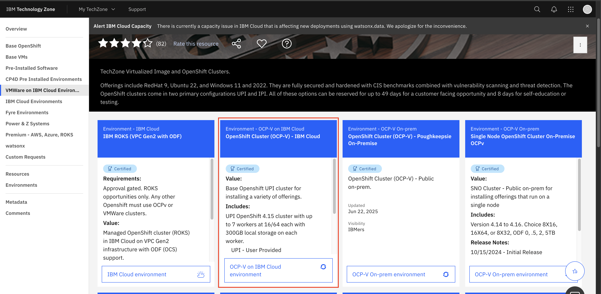
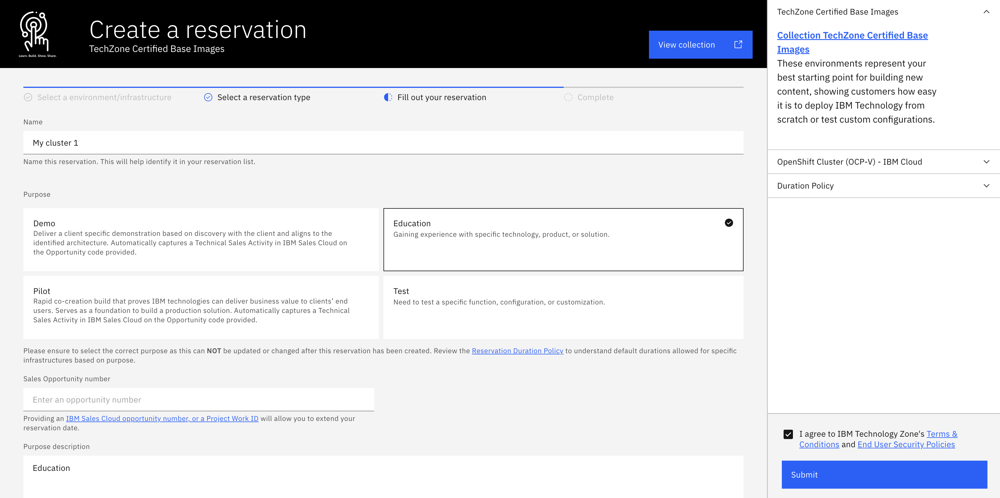
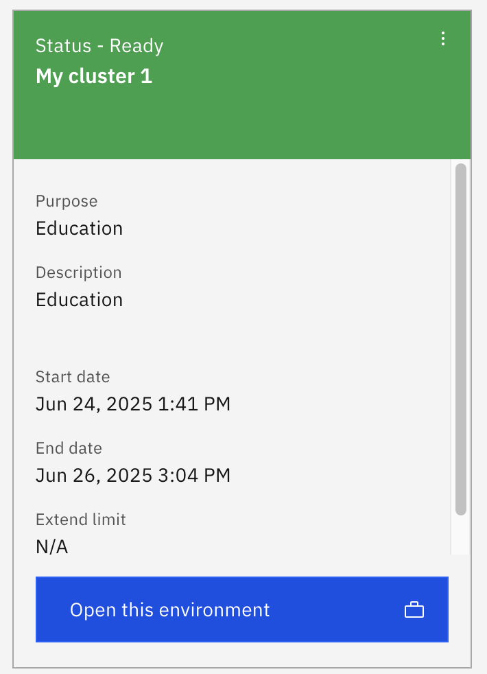
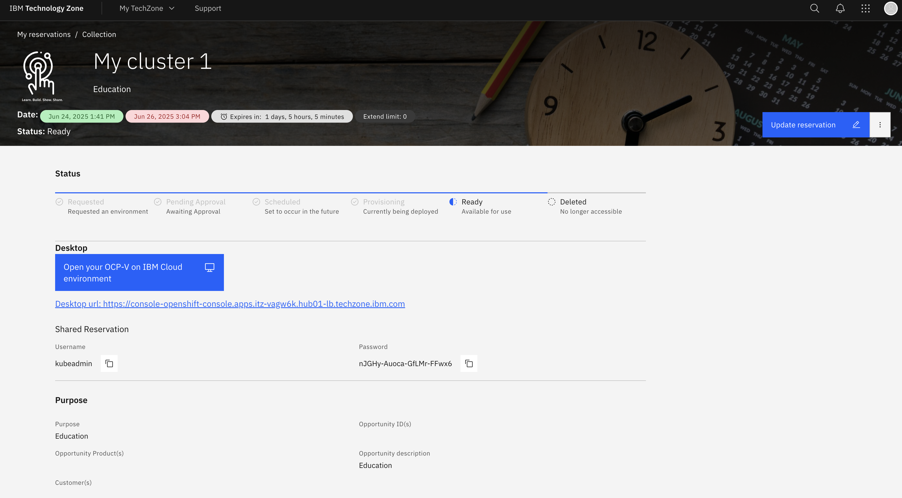

# Create the Cluster

**Audience:** Architects, Application Developers, Administrators

## Overview

In this topic, you will:

- Learn how to provision an OpenShift cluster on IBM Cloud
- Understand the cluster reservation process
- Configure cluster specifications for ACE workloads
- Monitor cluster provisioning status

By the end, you'll have a production-ready OpenShift cluster configured for App Connect Enterprise deployment.

## Prerequisites

Before creating your cluster, ensure you have:

- IBM Technology Zone account access
- Valid IBM credentials
- Understanding of your cluster requirements
- Network access to IBM Cloud services

## Cluster Creation Process

### 1. Navigate to IBM Technology Zone

1. In your browser, go to [IBM Technology Zone → Create Reservation](https://techzone.ibm.com/my/reservations/create/619e5691425423001fcc192e)
2. If you're not signed in, authenticate with your IBM credentials
3. Read and accept **Terms and Conditions** if prompted

### 2. Reserve a Cluster

On the **Environment Catalog** page, select **OpenShift Cluster (OCP-v) – IBM Cloud** and click **Reserve environment**.

### 3. Complete the Reservation Form

#### Step 1: Basic Details

Fill out the top section:

- **Cluster Name** - Choose a descriptive name for your cluster
- **Purpose** - Select from the available options
- **Description** - Required if you choose "Practice/Self-Education"
- **Sales Opportunity Number** - Include if you have one

#### Step 2: Advanced Options

Scroll down and configure the cluster specifications:

- **Preferred Geography** - Choose your preferred region (e.g., `London 5`, `HongKong 2`, `San Jose 04`)
- **End Date & Time** - Adjust default 3-day retention if needed
- **Worker Node Count:** `3` (recommended for production workloads)
- **Worker Node Flavor:** `4 vCPU x 16GB 100GB` (minimum for ACE workloads)

!!! tip "Tip"
    Keeping the default 3-day window is usually sufficient. GitOps makes reprovisioning quick if you need another environment.

!!! note "Important Notes"
    - **Provisioning takes 3–5 hours**
    - **By default, your cluster auto-deletes after 2 days**
    - Use **Schedule for later** if you plan to reserve it for a future demo or session

### 4. Watch for Email Notifications

You'll receive several email notifications during the provisioning process:

- **Provisioning Started** - Build process has begun
- **Cluster Ready** - Includes your cluster URL and expiry information
- **Daily Notice** - When 3 days remain until auto-deletion

To extend your cluster, visit **My reservations → Extend**.

### 5. Track Status in IBM Technology Zone

1. Go to **My reservations**
2. Monitor the **Status** column
3. When it reads **Ready**, your cluster is live and accessible

### 6. Access Your Cluster

Once ready, click the **Cluster URL** to open the OpenShift Console and begin navigating your new cluster.

## Cluster Specifications

### Recommended Configuration

For production ACE workloads, we recommend:

| Component | Specification | Rationale |
|-----------|---------------|-----------|
| **OpenShift Version** | 4.16+ | Latest stable release with full ACE support |
| **Worker Nodes** | 3 | High availability and redundancy |
| **Node Flavor** | 4 vCPU x 16GB | Sufficient resources for ACE workloads |
| **Storage** | 100GB | Adequate space for applications and logs |

### Resource Requirements

ACE applications typically require:

- **CPU:** 0.5-2 cores per integration runtime
- **Memory:** 512MB-2GB per integration runtime
- **Storage:** 10-50GB for application data and logs
- **Network:** Standard cluster networking

## Post-Provisioning Steps

Once your cluster is ready, you'll need to:

1. **Configure GitOps** - Set up ArgoCD for continuous deployment
2. **Install ACE Operator** - Deploy the App Connect Enterprise operator
3. **Configure Storage** - Set up persistent volumes for ACE applications
4. **Set up Monitoring** - Configure logging and metrics collection

## Troubleshooting

### Common Issues

**Cluster Provisioning Delays**
- Check IBM Technology Zone status page
- Verify your reservation details
- Contact support if delays exceed 6 hours

**Access Issues**
- Verify your IBM credentials
- Check network connectivity
- Ensure you're using the correct cluster URL

**Resource Limitations**
- Monitor cluster resource usage
- Scale worker nodes if needed
- Optimize ACE application resource requests

### Support Resources

- [IBM Technology Zone Documentation](https://techzone.ibm.com/docs)
- [OpenShift Documentation](https://docs.openshift.com/)
- [ACE Operator Documentation](https://www.ibm.com/docs/en/app-connect/12.0.x)

---

**Next Steps:** Once your cluster is ready, proceed to [Configure the Cluster](configure-cluster.md) to set up GitOps and prepare for ACE deployment. 