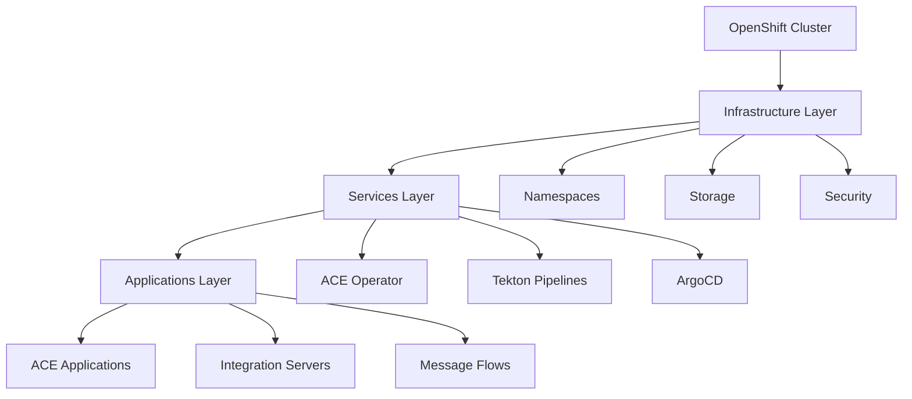

# ACE Production Guide

Welcome to the **App Connect Enterprise (ACE) Production Deployment Guide** - your comprehensive resource for deploying enterprise-grade ACE applications on OpenShift Container Platform using modern cloud-native practices.

## 🚀 What You'll Learn

This guide provides expert-level instructions for building, deploying, and managing ACE applications in production environments using:

- **IBM Cloud Pak for Integration (CP4I)**
- **OpenShift Container Platform**
- **GitOps workflows with ArgoCD**
- **CI/CD pipelines with Tekton**
- **Cloud-native best practices**

## 🎯 Target Audience

This guide is designed for:

- **Platform Engineers** - Setting up and managing the infrastructure
- **DevOps Engineers** - Implementing CI/CD pipelines and automation
- **Integration Developers** - Building and deploying ACE applications
- **System Administrators** - Managing production environments
- **Solution Architects** - Designing enterprise integration solutions

## 📋 What's Covered

### Foundation
- OpenShift cluster setup and configuration
- GitOps infrastructure with ArgoCD
- Security and compliance considerations

### Development
- ACE application development best practices
- Containerization and build processes
- Testing and validation strategies

### Deployment
- Production deployment patterns
- Environment promotion workflows
- Monitoring and observability

### Operations
- Troubleshooting and debugging
- Performance optimization
- Maintenance and updates

## 🏗️ Architecture Overview

Our production deployment follows a layered GitOps approach:



## 🛠️ Prerequisites

Before you begin, ensure you have:

- Access to an OpenShift 4.16+ cluster
- IBM Cloud Pak for Integration entitlement
- Basic knowledge of Kubernetes and OpenShift
- Familiarity with Git and CI/CD concepts

### Required Tools

The following tools are required for this guide:

- **OpenShift CLI (oc)** - Version 4.16 or newer
- **Git** - For version control and repository management
- **Node.js & npm** - For development tools
- **GitHub CLI (gh)** - For GitHub operations
- **jq** - For JSON processing
- **tree** - For directory structure visualization
- **Tekton CLI (tkn)** - For pipeline operations
- **kubeseal** - For sealed secrets management

### Quick Setup Script

For RHEL/CentOS/Fedora systems, you can use our automated prerequisites script:

```bash
# Download and run the prerequisites script
curl -O https://raw.githubusercontent.com/ibmexpertlabs/ACE_Production_Guide/main/prerequisites.sh
chmod +x prerequisites.sh
./prerequisites.sh
```

!!! tip "Installation Help"
    - Use the [OpenShift CLI installation guide](https://docs.openshift.com/container-platform/4.16/cli_reference/openshift_cli/getting-started-cli.html) for detailed setup instructions
    - The prerequisites script automatically installs most required tools
    - You'll still need to manually install the OpenShift CLI (oc) after running the script

## 🚦 Getting Started

This guide follows a structured approach to deploying ACE in production:

1. **Cluster Setup** - Create and configure your OpenShift cluster
2. **GitOps Configuration** - Set up ArgoCD and repository structure  
3. **Infrastructure Deployment** - Set up namespaces and resources
4. **Service Installation** - Deploy ACE operator and supporting services
5. **Application Building** - Create and deploy your ACE applications

## 📚 Repository Structure

This guide references four key repositories:

- **multi-tenancy-gitops** - Main GitOps orchestration
- **multi-tenancy-gitops-infra** - Infrastructure resources
- **multi-tenancy-gitops-services** - Service operators and instances
- **multi-tenancy-gitops-apps** - ACE applications and configurations

## 🤝 Contributing

This guide is maintained by IBM Client Engineering. For questions, suggestions, or contributions, please:

- Reach out to IBM Sales
- Contact the team through IBM Client Engineering channels
- Submit pull requests for improvements

## 📄 License

This project is licensed under the IBM License Agreement.

---

**Ready to get started?** Follow the structured approach above to deploy ACE in your production environment. 