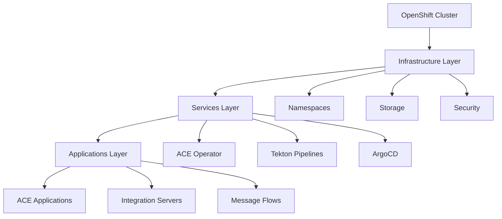

# ACE Production Guide

Welcome to the **App Connect Enterprise (ACE) Production Deployment Guide** - your comprehensive resource for deploying enterprise-grade ACE applications on OpenShift Container Platform using modern cloud-native practices.

## 🚀 What You'll Learn

This guide provides expert-level instructions for building, deploying, and managing ACE applications in production environments using:

- **IBM Cloud Pak for Integration (CP4I)**
- **OpenShift Container Platform**
- **GitOps workflows with ArgoCD**
- **CI/CD pipelines with Tekton**
- **Cloud-native best practices**

## 🎯 Target Audience

This guide is designed for:

- **Platform Engineers** - Setting up and managing the infrastructure
- **DevOps Engineers** - Implementing CI/CD pipelines and automation
- **Integration Developers** - Building and deploying ACE applications
- **System Administrators** - Managing production environments
- **Solution Architects** - Designing enterprise integration solutions

## 📋 What's Covered

### Foundation
- OpenShift cluster setup and configuration
- GitOps infrastructure with ArgoCD
- Security and compliance considerations

### Development
- ACE application development best practices
- Containerization and build processes
- Testing and validation strategies

### Deployment
- Production deployment patterns
- Environment promotion workflows
- Monitoring and observability

### Operations
- Troubleshooting and debugging
- Performance optimization
- Maintenance and updates

## 🏗️ Architecture Overview

Our production deployment follows a layered GitOps approach:

## 🛠️ Prerequisites

Before you begin, ensure you have:

- Access to an OpenShift 4.7+ cluster
- IBM Cloud Pak for Integration entitlement
- Basic knowledge of Kubernetes and OpenShift
- Familiarity with Git and CI/CD concepts

## 🚦 Getting Started

1. **Review the [Prerequisites](intro/prerequisites.md)** - Ensure your environment is ready
2. **Follow the [Cluster Setup](cluster/create-cluster.md)** - Create and configure your OpenShift cluster
3. **Configure [GitOps](cluster/configure-gitops.md)** - Set up ArgoCD and repository structure
4. **Deploy [Infrastructure](infrastructure/namespaces.md)** - Set up namespaces and resources
5. **Install [Services](services/ace-operator.md)** - Deploy ACE operator and supporting services
6. **Build [Applications](applications/build-config.md)** - Create and deploy your ACE applications

## 📚 Repository Structure

This guide references four key repositories:

- **multi-tenancy-gitops** - Main GitOps orchestration
- **multi-tenancy-gitops-infra** - Infrastructure resources
- **multi-tenancy-gitops-services** - Service operators and instances
- **multi-tenancy-gitops-apps** - ACE applications and configurations

## 🤝 Contributing

This guide is maintained by IBM Expert Labs. For questions, suggestions, or contributions, please:

- Open an issue on our [GitHub repository](https://github.com/ibmexpertlabs/ACE_Production_Guide)
- Contact the team through IBM Expert Labs channels
- Submit pull requests for improvements

## 📄 License

This project is licensed under the IBM License Agreement.

---

**Ready to get started?** Begin with the [Overview](intro/overview.md) to understand the complete deployment process, or jump directly to [Prerequisites](intro/prerequisites.md) to prepare your environment. 