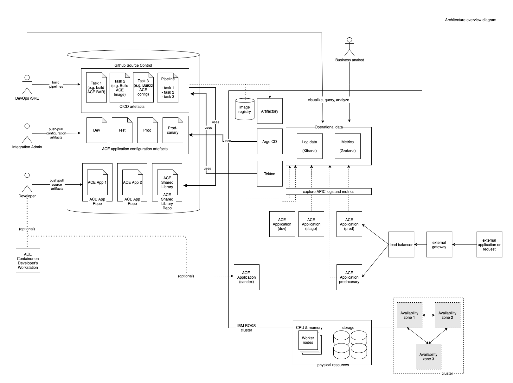

# Target Architecture

**Audience:** Architects, Integration Developers, Integration Administrators, Site Reliability Engineers

## Overview

In this topic, you will:

- Examine a high-level production deployment for ACE
- Review the Kubernetes runtime components
- Understand the GitOps model for ACE configuration and management
- Identify key users of an ACE deployment

By the end, you'll recognize the major components needed for a production-ready, cloud-native App Connect Enterprise deployment.

## Architecture Overview Diagram

The following diagram illustrates a typical ACE production deployment:

## Key Components

### Kubernetes Cluster

The Kubernetes cluster houses:

- **ACE Applications** - Your integration services and message flows
- **Cloud-Native Tooling** - Tekton, ArgoCD, Kibana, Grafana
- **Operators** - ACE Operator, Tekton Operator, ArgoCD Operator
- **Infrastructure** - Storage, networking, security components

### GitHub Repositories

GitHub repositories serve as the single source of truth for runtime configuration, containing:

- **ACE Application Source** - One repository per application
- **ACE Shared Library Source** - One repository per library
- **Application Configuration Artifacts** - Environment-specific configurations
- **CI/CD Definitions** - Tekton tasks and pipelines
- **GitOps Manifests** - ArgoCD application definitions

This Git-centric approach follows the **GitOps model** for declarative configuration and management of ACE on Kubernetes.

## Users & Roles

A variety of stakeholders interact with the ACE architecture:

### Development Team
- **Integration Developers** - Building and testing message flows
- **Application Developers** - Creating APIs and services
- **DevOps Engineers** - Managing CI/CD pipelines and automation

### Operations Team
- **Integration Administrators** - Managing deployments and configurations
- **Site Reliability Engineers** - Operating infrastructure and monitoring
- **Platform Engineers** - Managing the Kubernetes platform

### Business Team
- **Architects** - Defining solution designs and patterns
- **Business Analysts** - Specifying integration requirements
- **Product Owners** - Prioritizing features and requirements

### End Users
- **ACE Application Users** - Consuming the deployed services
- **API Consumers** - Using the exposed APIs
- **System Integrators** - Connecting to the integration platform

## GitOps Model

The architecture follows GitOps principles:

### Declarative Configuration
- All configurations are stored in Git
- Infrastructure is defined as code
- Changes are version-controlled and auditable

### Continuous Deployment
- ArgoCD monitors Git repositories for changes
- Automatic deployment when changes are detected
- Rollback capabilities through Git history

### Separation of Concerns
- Application code in source repositories
- Configuration in GitOps repositories
- Infrastructure managed through operators

## Production Considerations

### High Availability
- Multi-zone deployment across availability zones
- Replica sets for application redundancy
- Load balancing and health checks

### Security
- Network policies and security contexts
- Secrets management with external vaults
- RBAC and service accounts
- Image scanning and vulnerability management

### Monitoring & Observability
- Centralized logging with ELK stack
- Metrics collection with Prometheus
- Distributed tracing with Jaeger
- Alerting and incident management

### Scalability
- Horizontal pod autoscaling
- Resource quotas and limits
- Cluster autoscaling for infrastructure

## Technology Stack

### Core Platform
- **OpenShift Container Platform** - Enterprise Kubernetes
- **IBM Cloud Pak for Integration** - Integration platform
- **App Connect Enterprise** - Integration runtime

### CI/CD & GitOps
- **Tekton** - Cloud-native CI/CD pipelines
- **ArgoCD** - GitOps continuous delivery
- **GitHub** - Source code and configuration management

### Monitoring & Observability
- **Prometheus** - Metrics collection
- **Grafana** - Visualization and dashboards
- **Kibana** - Log analysis
- **Jaeger** - Distributed tracing

### Security & Compliance
- **OpenShift Security Context Constraints**
- **Network Policies** - Pod-to-pod communication
- **Secrets Management** - External vault integration

---

**Next Steps:** This architecture provides the foundation for building production-ready ACE applications. The following chapters will guide you through implementing each component step by step. 